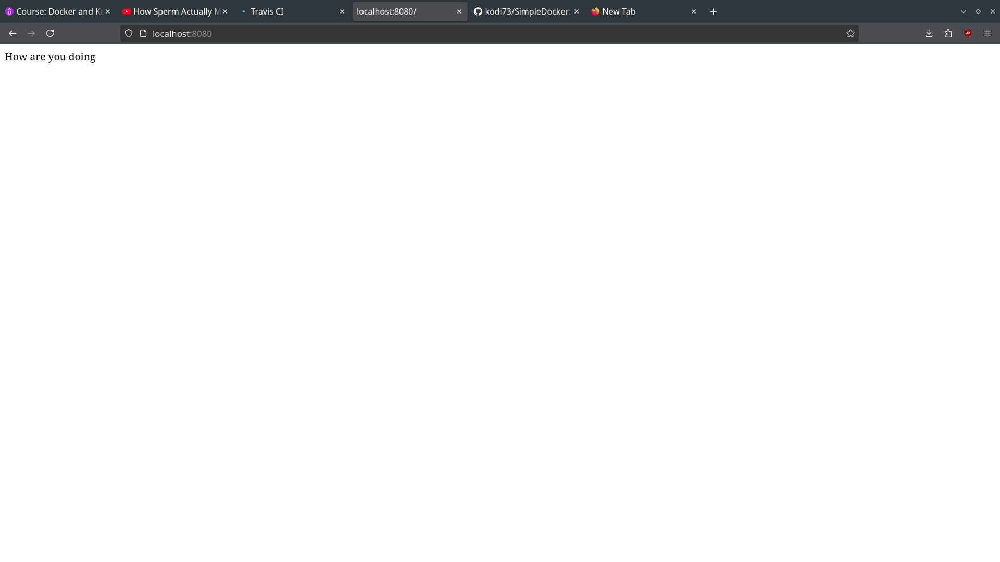

# SimpleDocker
This beginner project consists of the extremely simple implementation of Docker.

## Aim
To create a simple container and run it.

## Objective
To learn about the Docker commands and the instructions inside the Dockerfile.

## Tools
1. npm (Node package manager)
2. node:14-alpine image from Dockerhub
3. Docker

## Output

## Learning Outcomes
1. I learned how to minimize cache busting and rebuilds.
2. I learned how to set the Working Directory inside the container so that the files copied do not interfere with the container files.
3. I learned about the basic format of the Dockerfile.
4. I learned how to fetch necessary images from Dockerhub.
5. I learned about the basic files like index.js and package.json in a node application.